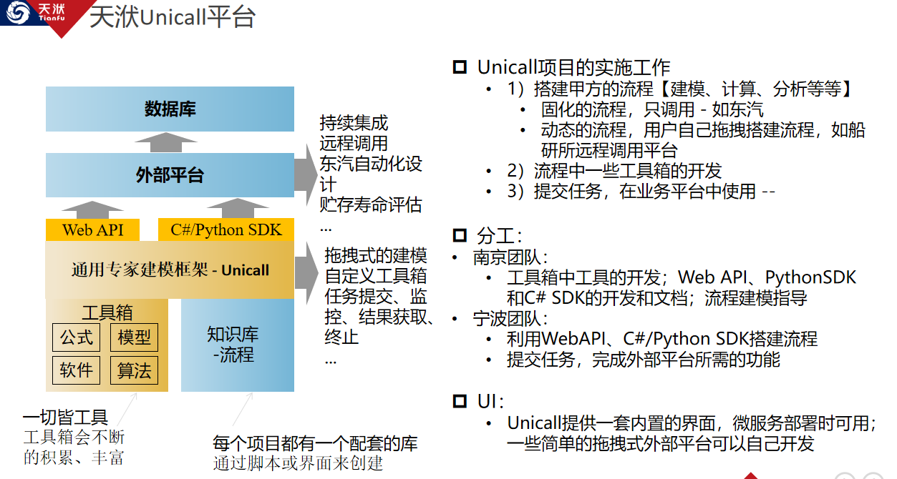

# 文档简介

* 本文档的来源 - 基于Unicall内部完备的功能函数接口.
* 本文档的目标 - 帮助各部门/项目的开发同事快速熟悉Unicall并基于其搭建任意复杂的工程以支撑项目的需求.
* 本文档的阅读对象 - 具有一定Python基础语法能力的软件开发同事.

# Unicall是什么？！
* **全称**: Unified Call / Unified Modeling Platform
* **定义**: 一个开放式的统一流程建模平台
* **描述**: Unicall由流程建模、执行引擎、任务调度三大部分组成，以节点拖拽的形式，设定迭代逻辑执行，建立业务流程
* **呈现**: Unicall各节点可以通过Python脚本形式创建, 然后执行/读取外部商业软件及模型文件等，最终搭建实现任意复杂流程的流程(process)
* **特色**: Unicall内置工具箱,提供流程控制，自检，分布式等功能, 并支持Matlab、Excel、python、exe、dll等封装模块包和软件的集成调用
* **关系**: Unicall作为天洑通用的流程建模支撑平台，是Aipod, DTEmpower, 智能运维平台等的基石, 可看作汽车发动机的作用

# unicall解决的痛点：
1. 解决专家知识的沉淀问题 
2. 提升人员的工作效率
3. 降低企业的生产成本（1人员素质要求降低  2人员数量减少）

## 通俗的解决方案：
1. 工业软件 （成本相对低，缺点是无法迎合客户个性化的需求及所有需求）
2. 定制化系统 （针对上述问题进行开发，缺点是成本高 周期长，且用户受软件企业的绑架，另外开发商质量层次不齐，很多定制化系统生命周期短，使用率不高）

## unicall如何解决该痛点：
1. 让用户自己定制化系统，积淀专家知识
2. 知识获取：图形化编程，降低系统编程的门槛（使专家不依赖于开发人员，可以独立的进行知识建模）
3. 知识管理：提供知识管理的能力（工程和工具箱）工业软件也是通过工具箱形式提供给用户且一切业务即工具箱节点
4. 软件应用：以任务的形式  调用搭建好的流程
5. todo:流程打包成软件 输出exe  生成mini的自有工业软件

# unicall最终目标：

1. 实现工业届的无人化设计 无人化运维（让人进行创造性的工作）
2. 补充案例说明

# unicall架构

# 二次开发流程图

# 二次开发说明 
* 最终产物 : `生成一个包含对应流程的工程数据库文件夹(用于Unicall启动和流程执行)和动态工具箱hooks文件夹(可选).`
* 具体形式 : `通过在python脚本中调用Unicall平台的相关模块完成业务流程的搭建 测试.`

# 版本信息
## 版本号
* Unicall 2022R2
## 修订日期
* 20220930
## 修订人/审核人
* 衡浩/杨文广