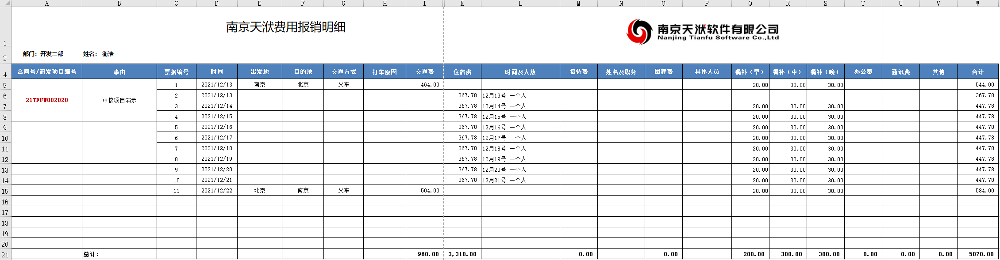

# 本文档基于mkdocs工具进行编写

完整的官方文档请访问 [mkdocs.org](https://www.mkdocs.org).


## mkdocs命令行

* `mkdocs new [dir-name]` - Create a new project.
* `mkdocs serve` - Start the live-reloading docs server.
* `mkdocs build` - Build the documentation site.
* `mkdocs -h` - Print help message and exit.

## 项目布局

    mkdocs.yml    # The configuration file.
    docs/
        index.md  # The documentation homepage.
        ...       # Other markdown pages, images and other files.

## 表格
| First Header | Second Header | Third Header |
| ------------ | ------------- | ------------ |
| Content Cell | Content Cell  | Content Cell |
| Content Cell | Content Cell  | Content Cell |

## 代码块
```
Fenced code blocks are like Stardard
Markdown regular code blocks, except that
theye not indented and instead rely on a
start and end fence lines to delimit the code
block.
```

Cupcake indexer is a snazzy new project for indexing small cakes.



*Above: Cupcake indexer in progress*
