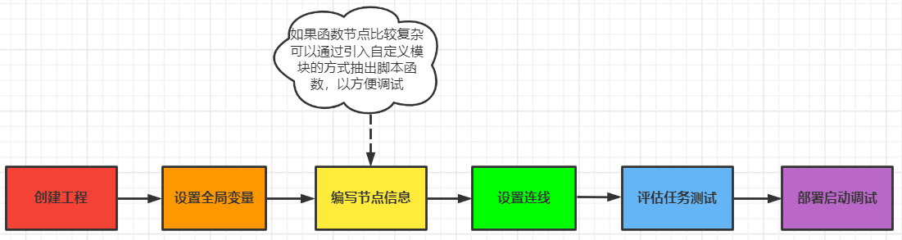

# 文档简介

* 本文档的来源 - 基于Unicall内部完备的功能函数接口.
* 本文档的目标 - 帮助各部门/项目的开发同事快速熟悉Unicall并基于其搭建任意复杂的工程以支撑项目的需求.
* 本文档的阅读对象 - 具有一定Python基础语法能力的软件开发同事.

# Unicall是什么？！
* **全称**: Unified Call / Unified Modeling Platform
* **定义**: 一个开放式的统一流程建模平台
* **描述**: Unicall由流程建模、执行引擎、任务调度三大部分组成，以节点拖拽的形式，设定迭代逻辑执行，建立业务流程
* **呈现**: Unicall各节点可以通过Python脚本形式创建, 然后执行/读取外部商业软件及模型文件等，最终搭建实现任意复杂流程的流程(process)
* **特色**: Unicall内置工具箱,提供流程控制，自检，分布式等功能, 并支持Matlab、Excel、python、exe、dll等封装模块包和软件的集成调用
* **关系**: Unicall作为天洑通用的流程建模支撑平台，是Aipod, DTEmpower, 智能运维平台等的基石, 可看作汽车发动机的作用

# unicall架构

# 二次开发流程图

# 二次开发说明 
* 最终产物 : `生成一个包含对应流程的工程数据库文件夹(用于Unicall启动和流程执行)和动态工具箱hooks文件夹(可选).`
* 具体形式 : `通过在python脚本中调用Unicall平台的相关模块完成业务流程的搭建 测试.`

# 版本信息
## 版本号
* Unicall 2022R2
## 修订日期
* 20220930
## 修订人/审核人
* 衡浩/杨文广