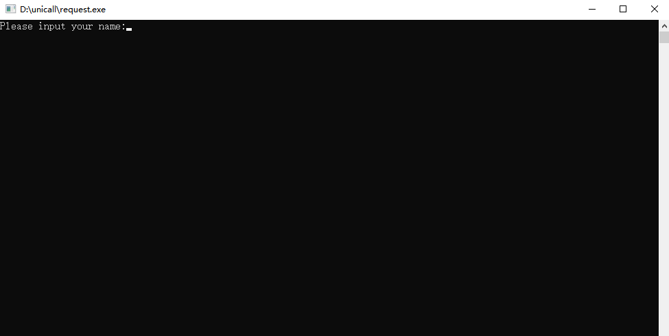
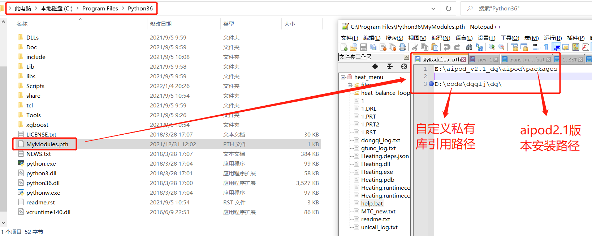

## 基础环境搭建和启动
### unicall 安装部署(windows)
* 下载并安装最新的unicall主程序并配置license
   
   找到 unicall 的安装路径，执行其中的 request.exe 程序（需要注意的是，
若安装路径在系统盘，需要以管理员身份运行），弹出用户信息配置弹窗

在窗口中录入用户名后单击【回车】键，在安装路径下会生成与当前计算机
硬件信息匹配的许可请求文件 request.txt

   
* 许可配置

   将生成的许可请求文件发送给天洑软件(联系衡浩)，将传回的 license.dat 文件放置在软件安装路径根目录下，即完成了许可文件的配置。

   需要注意的是许可文件与生成许可请求文件时的计算机硬件匹配，若完成许
可文件配置后存在更换主板、更换硬盘等情况，需要重新申请并配置许可文件。
此外，许可文件使用时会记录每次的使用时间，服务器迁移等可能引发系统时间
变更的操作会导致许可文件失效，需要重新申请并配置许可文件。
### 服务启动
    
    PS D:\hengh\unicall> unicall.exe start <工程包名>
    start listening at http://localhost:5001

* `unicall start [proj_name]` - 在Unicall安装目录下打开cwd并键入该命令然后加载项目.
* 通过链接下载并安装[Python3.6](https://www.python.org/downloads/release/python-365/)

### Unicall 安装部署(centos)
    
    [njtf@localhost unicall]$ ./unicall start 工程包名/
    start listening at http://localhost:60013

* `unicall-CentOS7-Free.tar.gz` - 通常linux版本的unicall都是tar.gz格式.
* `tar -xzvf unicall-CentOS7-Free.tar.gz`   - 解压unicall
* `./update`   - 升级unicall

### pth 文件配置(二次开发时才需要)
    Python在遍历已知的库文件目录过程中，如果见到一个.pth 文件，就会将文件中所记录的路径
    加入到 sys.path 设置中，于是 .pth 文件说指明的库也就可以被 Python 运行环境找到了

* 如下图配置.pth文件在python.exe所在路径下
* 自定义的私有库用于复杂的函数节点,此处通过在pth文件中导入文件地址，即可当作python的第三方包一样引入

## unicall升级
将升级包update-unicall-20220627.zip放入unicall根目录下

### 安装包存放路径

以管理员权限运行update.exe, 执行结果显示Update Succeeded即为安装成功

## 可能遇到的问题

## Linux服务更新说明
放到应用程序根目录，然后在根目录启动 Terminal，执行 ./update 命令

如上图所示，执行过程中出现拒绝访问的报错信息，可关闭当前unicall相关程序或重启计算机后再次重新运行更新脚本

类库缺失

* 异常点检测算法工具库（pyod）
* 机器学习模型合并工具库combo
* xgboost
* seaborn
* minepy

cmd 通过pip安装对应类库
`pip install {package}`

