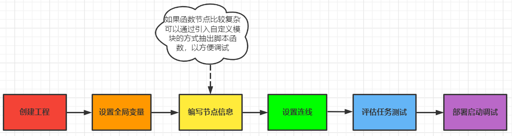

# 二次开发教程
* 二次开发的最终产物 - `通过内部脚本生成一个包含对应流程的工程目录(用于aipod执行和启动).`
## 二次开发流程图

## 生成的工程文件组织结构
    project_name         # 项目文件夹名称(自定义)
        cwd/             # 执行任务的工作目录
            ...
        default/         # 流程、结果集、代理模型、任务数据库文件等常量数据文件
            ...
        log/             # 日志文件目录
            ...
        tmp/
            ...
        default.aipod    # 项目配置文件
        log.db3          # 日志数据库
## 内部接口函数明细

### 工程侧常用方法
| 序号| 对象名 | 作用 | 所属模块 |
| ------------ | ------------- | ------------ |------------ |
| 1 | Solution  | 流程操作对象 |aipod |
| 2 | create_default_solution | 创建aipod工程函数 |aipod |
| 3 | open_aipod_project  | 打开aipod工程函数 |aipod |

    """创建工程的示例代码(仅包含工程创建和函数节点，此时尚不可打包为流程文件夹)"""

    # 1. 导入aipod内置的方法
    from aipod import Solution, create_default_solution, open_aipod_project
    # 2. 创建并获取工程对象solution
    solution = create_default_solution(path, title="", port=60007, description="").default
    # 3. 通过solution获取模型入口对象
    calcmodel_cli = solution.get_calcmodel_cli()
    # 4. 通过模型入口对象添加graph模型并构造流程名称及配置描述信息
    graph_model = calcmodel_cli.add_graph_model(name="流程名称", description="描述信息")
    # 5. 通过模型入口对象添加graph模型并构造流程名称及配置描述信息(该方法需要和对应的节点配套使用)
    graph_model.add_dynamic_file(name="data.zip", description="动态文件描述", rel_path='data.zip')
    # 6. 通过模型入口对象添加graph模型并构造流程名称及配置描述信息
    func_node = graph_model.add_func_node(name="函数节点名称", is_private_cwd=False, function="""python脚本""")
    # 7. func_node和流程对应 也增加动态文件
    func_node.add_dynamic_file(name="data.zip", description="动态文件描述", rel_path='data.zip')

### 流程侧常用方法
| 序号| 对象名 | 作用 | 上层对象 | 备注 |
| ------------ | ------------- | ------------ |------------ |------------ |
| 1 | add_graph_model | 流程操作对象 |aipod |-------- |
| 2 | add_func_node | 创建aipod工程函数 |aipod |-------- |
| 3 | add_exe_node | 打开aipod工程函数 |aipod |-------- |
| 4 | add_process_group | 获取流程组信息 |get_calcmodel_cli |-------- |
| 5 | add_subprocess | 获取子流程 |add_process_group |-------- |
| 6 | add_dynamic_file | 添加动态文件 |add_graph_model |-------- |
| 7 | add_input_variable | 添加输入变量 |model/node| 全局/节点均支持 |
| 8 | add_output_variable | 添加输出变量 |model/node| 全局/节点均支持 |
| 9 | add_loop_node | 添加循环节点 |model |-------- |
| 10 | add_local_input_variable | 添加节点输入变量 |model |-------- |
| 11 | add_condition_node | 添加判定节点 |model |-------- |
| 12 | add_autoinc_node | 循环自增节点 |model |-------- |
| 13 | add_or_node | 增加并行判断节点 |model |-------- |
| 14 | upload | 附件的上传函数 |add_attachment |-------- |
| 15 | add_attachment | exe节点增加附件 |add_exe_node |-------- |
| 16 | update_post_out_trigger | exe节点触发器 |add_exe_node |-------- |
| 17 | add_in_line | 流程输入连线 |model |add_subprocess/add_graph_model等均可 |
| 18 | add_line | 流程普通连线 |model |add_subprocess/add_graph_model |
| 19 | add_out_line | 流程输出连线 |model |add_subprocess/add_graph_model |
    
    # 完整的流程示例
    model = cli.add_graph_model(name="demo_process", description="")
    model.add_input_variable(name="file_content", description="", 
                             datatype_id=DataType.String, is_to_global=True)
    ......(省略流程更多全局的输入输出变量)
    model.add_output_variable(name="logs", datatype_id=DataType.String, is_from_global=True)

    # 日志预处理函数节点
    model.add_func_node(name="log_file_check", is_private_cwd=False, function="""
    import os
    
    if os.path.exists(os.path.join({{__cwd__}}, "xxx.txt")):
        os.remove(os.path.join({{__cwd__}}, "xxx.txt"))
    while True:
        if not os.path.exists(os.path.join({{__cwd__}}, "xxx.txt")):
            break
    """)
    # func1 函数节点
    node = model.add_func_node(name="func1", is_private_cwd=False, 
                               description="xxx", function="""
    from dq import unit
    
    test = unit.MoldedLinesImportGetInFile({{__cwd__}}, file_content, up_path, copy_path)

    test.run()

    input_file_content = test.file_content.getvalue()
    """)

    node.add_input_variable(name="input_var1", description="xxx", datatype_id=DataType.String, 
                            is_from_global=True)
    ......
    node.add_output_file(name='xxx', description="xxx", rel_path="xxx", 
                         format_type=FileFormatType.Text)

    node.add_output_variable(name="output_var1", datatype_id=DataType.String, is_to_global=True)

    # exe执行节点
    model.add_exe_node(name="exe", is_private_cwd=False, description="型线导入程序",
                             timeout=-1, is_local=False, shell=False,
                             check_returncode=True, env=None,
                             type_name=None, check_stderror=False,
                             command="{{__cwd__}}/demo.exe")

    # func2函数节点
    node = model.add_func_node(name="func2", is_private_cwd=False, 
                               description="输出文件解析", function='''
    from dq import unit
    parameters, output_files_content = unit.xxx_func({{__cwd__}} , copy_path)
    ''')

    node.add_input_variable(name="copy_path", description="xxx", 
                            datatype_id=DataType.String, is_from_global=True )
    ......
    node.add_output_variable(name="output_files_content", datatype_id=DataType.String, is_to_global=True)

    node = model.add_func_node(name="read_log_content", is_private_cwd=False, function="""
    import os
    
    with open(os.path.join({{__cwd__}}, "xxx.txt"), "r") as f:
        logs = f.read()
    """)
    node.add_output_variable(name="logs", datatype_id=DataType.String, is_to_global=True)

    # 节点连线
    model.add_in_line("log_file_check")
    model.add_line("log_file_check", "func1")
    ... ...(省略类似连线)
    model.add_line("func1", "func2")
    model.add_out_line("func2")

### 其他方法
* `mkdocs new [dir-name]` - Create a new project.
* `mkdocs serve` - Start the live-reloading docs server.

## 流程图应用示例

    mkdocs.yml    # The configuration file.
    docs/
        index.md  # The documentation homepage.
        ...       # Other markdown pages, images and other files.
