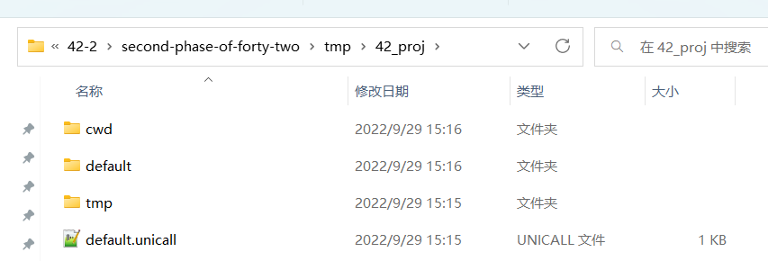

# 二次开发教程
* 二次开发的最终产物 : `通过内部脚本生成一个包含对应流程的工程文件夹(用于Unicall执行和启动).`
* 二次开发的具体形式 : `通过在python脚本中调用Unicall平台的相关函数完成业务流程的搭建.`

## 领域术语释义

| 序号  | 专有名词 | 中文释义 |  领域释义 | 备注             |
|-----| ------------- |--| ------------ |----------------|
| 1   |solution| 工程 |层级最高的文件结构| 2.1版本仅允许创建一个工程 |
| 2   |process| 流程 |计算的线性过程| 一个工程可创建多个流程    |
| 3   |model| 模型 |可执行的计算单元组| model有执行引擎的概念  |
| 4   |node| 节点 |特定功能的计算单元| 特定功能的计算单元      |
| 5   |simulation task| 评估任务 |自动化的计算流程| unicall任务类型之一  |
| 6   |var| 变量 |计算结果储存的抽象概念|
| 7   |CWD| 当前工作目录 |unicall任务执行的路径|
| 8   |Line| 连线 |节点之间数据传递管理|
| 9   |unicall| 任务调用管理 |任务定义执行器构造| UniLab的后端      |
| 10  |gfunc| 全局函数 |任务数据引擎的缓存和构造| unicall的后端     |

## 开发流程图

## 工程文件组织结构
    project_name         # 项目文件夹名称(自定义)
        cwd/             # 执行任务的工作目录
            ...
        default/         # 流程、结果集、代理模型、任务数据库文件等常量数据文件
            ...
        log/             # 日志文件目录
            ...
        tmp/
            ...
        default.unicall    # 项目配置文件
        log.db3          # 日志数据库

## 工程文件截图

## 内部接口函数明细

### 工程侧常用方法
| 序号| 对象名                     | 作用           | 所属模块    |
| ------------ |-------------------------|--------------|---------|
| 1 | Solution                | 流程操作对象       | unicall |
| 2 | create_default_solution | 创建unilab工程函数 | unicall   |
| 3 | open_uniab_project      | 打开unilab工程函数  | unicall   |

    """创建工程的示例代码(仅包含工程创建和函数节点，此时尚不可打包为流程文件夹)"""

    # 1. 从Unicall导入solution相关的内置方法
    from unicall.persistence import Solution, create_default_solution

    # 2. 创建并获取工程对象solution
    solution = create_default_solution(path, title="", port=60007).default

    # 3. 通过solution获取模型入口对象
    calcmodel_cli = solution.get_calcmodel_cli()

    # 4. 通过模型入口对象添加graph模型并构造流程名称及配置描述信息
    graph_model = calcmodel_cli.add_graph_model(name="流程名称")

    # 5. 通过模型入口对象添加graph模型并构造流程名称及配置描述信息(该方法需要和对应的节点配套使用)
    graph_model.add_dynamic_file(name="data.zip", rel_path='data.zip')

    # 6. 通过模型入口对象添加graph模型并构造流程名称及配置描述信息
    func_node = graph_model.add_func_node(name="函数节点名称", function="""python脚本""")

    # 7. func_node和流程对应 也增加动态文件
    func_node.add_dynamic_file(name="data.zip", rel_path='data.zip')

### 流程侧常用方法
| 序号| 对象名 | 作用 | 上层对象              | 备注 |
| ------------ |:--------------| ------------ |-------------------|------------ |
| 1 | add_graph_model | 流程操作对象 | unicall|-------- |
| 2 | add_func_node | 创建aipod工程函数 | aipod             |-------- |
| 3 | add_exe_node | 打开aipod工程函数 | aipod             |-------- |
| 4 | add_process_group | 获取流程组信息 | get_calcmodel_cli |-------- |
| 5 | add_subprocess | 获取子流程 | add_process_group |-------- |
| 6 | add_dynamic_file | 添加动态文件 | add_graph_model   |-------- |
| 7 | add_input_variable | 添加输入变量 | model/node        | 全局/节点均支持 |
| 8 | add_output_variable | 添加输出变量 | model/node        | 全局/节点均支持 |
| 9 | add_loop_node | 添加循环节点 | model             |-------- |
| 10 | add_local_input_variable | 添加节点输入变量 | model             |-------- |
| 11 | add_condition_node | 添加判定节点 | model             |-------- |
| 12 | add_autoinc_node | 循环自增节点 | model             |-------- |
| 13 | add_or_node | 增加并行判断节点 | model             |-------- |
| 14 | upload | 附件的上传函数 | add_attachment    |-------- |
| 15 | add_attachment | exe节点增加附件 | add_exe_node      |-------- |
| 16 | update_post_out_trigger | exe节点触发器 | add_exe_node      |-------- |
| 17 | add_in_line | 流程输入连线 | model             |add_subprocess/add_graph_model等均可 |
| 18 | add_line | 流程普通连线 | model             |add_subprocess/add_graph_model |
| 19 | add_out_line | 流程输出连线 | model             |add_subprocess/add_graph_model |

## 流程应用示例
### 示例一: exe+函数节点流程
#### 流程搭建的完整代码
    import os
    from unicall import DataType
    from unilab.persistence import Solution, create_default_solution

    # 示例代码1
    def add_demo1_model(cli):  # cli是unicall的接口管理对象 包含了任务管理的上下文信息
        proc = cli.add_process_group(name="demo1", template_name="default")
        model = proc.add_subprocess(type_id=3, name="demo1").model
    
        model.add_input_variable(name="input1", datatype_id=DataType.Int, is_to_global=True)
        model.add_output_variable(name="output1", datatype_id=DataType.Int, is_from_global=True)
    
        # 1 函数节点
        node = model.add_func_node(name="func1", function="""
        output1 = input1 + 1
        """)
        node.add_input_variable(name="input1", datatype_id=DataType.Int, is_from_global=True)
        node.add_output_variable(name="output1", datatype_id=DataType.Int, is_to_global=True)
    
        # 线的连接
        model.add_in_line("func1")
        model.add_out_line("func1")

    def build_project_test():
        path = os.path.abspath(os.path.join(os.path.dirname(__file__), "./tmp/demo"))
        sln = create_default_solution(path,
                                      title="",
                                      port=60007,
                                      description="").default  # 默认工程
        add_demo1_model(sln.get_db_cli())
        test_open()

    def test_open():
        proj = Solution.Open(os.path.abspath(os.path.join(os.path.dirname(__file__), "./tmp/demo"))).default
        print(proj.pprint())

    if __name__ == '__main__':
        build_project_test()

#### 流程测试(使用脚本)
    import os
    from unilab.persistence import Solution
    from unilab.scheduler import Scheduler
    
    
    def get_path(path):
        return os.path.join(os.path.dirname(__file__), path)
    
    
    def create_task(sln, override=True):
        name = "simu"
        task = sln.get_task_by_name(name)
        if task is not None:
            print(f"simu task '{name}' has been added.")
            if override:
                sln.unilab_dbmgr.delete_task(task.ID)
            else:
                return
        dbmgr = sln.get_db_cli()
        dbmgr.add_singleeval_task(name=name,
                                  cwd="",
                                  model_id="demo1",
                                  # sub_type_id=1,
                                  inputs={"input1": 1})
    
    
    def submit_task(sln):
        scheduler = Scheduler(sln)
        scheduler.submit_task("simu")
        scheduler.start_service()
    
    
    if __name__ == '__main__':
        import sys
        import logging
        from unilab.utils.log_helper import logger_helper  # 日志记录器
        logger_helper.add_stream_handler("default", stream=sys.stderr, level=logging.DEBUG)
        logger_helper.logger.info("start demo")
        path = get_path("./tmp/demo")
        sln = Solution.Open(path)
        # 创建任务
        create_task(sln.default)
        # 提交测试任务并开启服务
        submit_task(sln)

#### 流程测试脚本的终端输出
    "C:\Program Files\Python36\python.exe" D:/code/dqqlj/demo/test_simu.py
    13376
    2022-01-12 15:48:44,049 - INFO - start test
    simu task 'simu' has been added.
    2022-01-12 15:48:44,236 - DEBUG - add_singleeval_task simu for model 1
    2022-01-12 15:48:44,238 - DEBUG - >> check_timeout thread wait for agent
    2022-01-12 15:48:44,262 - INFO - Submit task 2, external_process=False
    2022-01-12 15:48:44,262 - INFO - Activate task 2
    2022-01-12 15:48:44,281 - INFO - create executor for model 1/1, proc_timeout=-2.0, model_timeout=-1.0
    p1 said: slave lpid 1 embedded pid: 13376, starting...
    p1 said: slave lpid 1 initialized
    p1 said: slave pid 13376
    2022-01-12 15:48:44,418 - DEBUG - Good news! task 1 is accepted, left tasks 0.
    start listening at http://localhost:60007
    2022-01-12 15:48:44,801 - INFO - task 2 succeeded.
    simu report:
        inputs:{'input1': 1}
        result:{'output1': 2}

#### 流程用搭载前端的AIPOD优化软件打开后的流程图

### 示例二: exe节点+函数节点流程
#### 流程搭建的完整代码
    import os
    import sys
    
    __dirname__ = os.path.dirname(__file__)
    
    
    def get_path(path):
        return os.path.join(__dirname__, path)
    
    
    sys.path.append(get_path("../../"))
    
    import shutil
    from unicall.persistence import Solution, create_default_solution, open_aipod_project
    
    
    def add_demo2_model(cli):
        proc = cli.add_process_group(name="demo2", template_name="default", description="管道力学计算软件调用")
        graph = proc.add_subprocess(type_id=3, name="demo1").model
        graph.add_dynamic_file(name="data.zip", description="配置文件的压缩包", rel_path='data.zip')
    
        # 解压压缩包预处理函数
        func_node = graph.add_func_node(name="unzip_preproc_func", is_private_cwd=False, function="""
    import os
    import zipfile
    
    # for files in os.listdir({{__cwd__}}):
    #     if not files.endswith(".bat"):
    #         os.remove(os.path.join({{__cwd__}},files))
                
    # ----清空操作分割----- 
    
    if not os.path.exists(os.path.join({{__cwd__}}, "data.zip")):
        raise Exception("输入文件压缩包不存在！")
    try:
        zip_file = zipfile.ZipFile(os.path.join({{__cwd__}}, "data.zip"))
        zip_list = zip_file.namelist() # 得到压缩包里所有文件
        
        for f in zip_list:
            zip_file.extract(f, {{__cwd__}}) # 循环解压文件到指定目录
            
        zip_file.close() # 关闭文件，必须有，释放内存
    except Exception:
        raise Exception("输出文件夹解压异常")
    """)
        func_node.add_dynamic_file(name="data.zip", description="配置文件的压缩包", rel_path='data.zip')
    
        # exe执行节点
        exe = graph.add_exe_node(name="exe", is_private_cwd=False, description="中核exe节点",
                                 timeout=-1, is_local=False, shell=False,
                                 check_returncode=True, env=None,
                                 type_name=None, check_stderror=False,
                                 command="{{__cwd__}}/runAnsys.bat")
        # attachment = exe.add_attachment(name="bat_file", description='附件上传bat文件', rel_path='runAnsys.bat')
        # attachment.upload(r"C:\Users\heng\Desktop\中核计算软件调用\设备力学计算\ansysTest\runAnsys.bat")
        # 输出触发器 将当前文件夹下面所有的文件压缩
        exe.update_post_out_trigger('''
    import os, zipfile
    
    try:
        z = zipfile.ZipFile(os.path.join({{__cwd__}}, "result.zip"), 'w', zipfile.ZIP_DEFLATED)  # 参数一：文件夹名
        for dirpath, dirnames, filenames in os.walk({{__cwd__}}):
            fpath = dirpath.replace({{__cwd__}}, '')  # 这一句很重要，不replace的话，就从根目录开始复制
            fpath = fpath and fpath + os.sep or ''  # 实现当前文件夹以及包含的所有文件的压缩
            for filename in filenames:
                if filename != "result.zip":
                    z.write(os.path.join(dirpath, filename), fpath + filename)
                    print('压缩成功')
        z.close()
    except Exception:
        raise Exception("输出文件夹压缩异常")
    ''')
    
        # 创建图的连线
        graph.add_in_line("unzip_preproc_func")
        graph.add_line("unzip_preproc_func", "exe")
        graph.add_out_line("exe")
    
    
    def create_unilab_sln(path, is_clear=True):
        if is_clear and os.path.exists(path):
            shutil.rmtree(path)
        sln = create_default_solution(path,
                                      title="",
                                      port=60007,
                                      description="").default
        cli = sln.get_calcmodel_cli()
        create_cu_pipestress(cli)
        create_cu_ansys(cli)
    
    def update_worker_num(path):
        proj_cli = open_unilab_project(os.path.join(path, "default")).get_db_cli()
        proj_cli.update_surrogate("cnnc_calc_ansys",
                                  exec_type_id=1,
                                  worker_num=10,  # 工作线程更新为10
                                  task_timeout=36000,
                                  password=None)
        proj_cli.update_surrogate("cnnc_calc_pipestress",
                                  exec_type_id=1,
                                  worker_num=10,
                                  task_timeout=36000,
                                  password=None)
    
    def test_open(path):
        proj = Solution.Open(path).default
        print(proj.pprint())
    
    
    if __name__ == '__main__':
        import logging
        from unicall.utils.log_helper import logger_helper
        logger_helper.add_stream_handler(name="default", level=logging.DEBUG)
    
        path = get_path("../tmp_proj_dir/cnnc_proj")
        create_unilab_sln(path)
        # update_worker_num(path)  增加并发用
        test_open(path)

#### 流程测试(使用API)
    STEP1 新增并配置评估任务信息:
    接口: /api/task/simulation/add [post]

    请求参数:
    {
        "Name":"TEST-流程1",  //本次的评估任务名称
        "ModelID":3,  //流程id  事先约束好 或者通过/api/calcmodel/process/get_all接口根据name筛选(calcmodel t_process表中也有对应的数据信息)   3是ansys调用
        "Cwd":"",  //流程执行路径 可以不传 不传的话 内部自动分配执行路径（exe节点将附件上传）
        "Description":"",  //描述 必传 给空即可
        "Inputs":{
    
        }  //流程全局参数
    }

    返回参数:
    {
        "ResponseCode":0,
        "ResponseName":null,
        "ResponseMsg":null,
        "ResponseContent":{
            "ID":215,  //任务id 给后续的submit接口用
            "Name":"TEST-流程1",
            "TypeID":2,
            "SubTypeID":null,
            "State":1,
            "ModelName":"流程1",
            "ModelID":1,
            "Description":"",
            "Cwd":"",
            "Inputs":[
    
            ]
        }
    }

    STEP2 获取评估任务所需动态文件:
    接口: /api/task/simulation/get_dynamic_files?ID=2 [GET]

    请求参数:  
    ID=1  //任务id
    _t = 1639711060447 // 查询开始时间

    返回参数
    {
        "ResponseCode": 0,
        "ResponseName": null,
        "ResponseMsg": null,
        "ResponseContent": [
            {
                "ID": 2,  //文件id  此次数会用在上传的接口的 fileid参数中
                "TypeID": 1,
                "InputType": 1,
                "Name": "data.zip",
                "CallUnitID": 3,
                "IsDynamic": true,
                "Description": "配置文件的压缩包",
                "RelPath": "data.zip",
                "AbsPath": "D:\\code\\cnnc-calc-platf\\tmp_proj_dir\\cnnc_proj\\default\\tfd\\3\\0\\1\\2-",
                "IsFileExist": false
            }
        ]
    }

    STEP3 评估任务upload文件:
    接口: /api/task/simulation/upload [POST]

    请求参数:  
    输入参数:  【form data】
    ID=1  //任务id
    FileID=1  //该值来自于 获取动态文件接口返回的id
    File -> 上传的文件
    
    返回参数
    {
        "ResponseCode": 0,
        "ResponseName": null,
        "ResponseMsg": null,
        "ResponseContent": {
            "upload_path": "D:\\code\\cnnc-calc-platf\\tmp_proj_dir\\cnnc_proj\\default\\tfd\\3\\0\\1\\1-"
        }
    }

    STEP4 提交评估任务:
    接口: /api/task/task/submit [POST]

    请求参数:  
    {
      "ID": "2"  //该数据来自add接口执行后返回的id值
    }

    返回参数
    {
        "ResponseCode":0,
        "ResponseName":null,
        "ResponseMsg":null,
        "ResponseContent":{
            "ID":215,
            "ModelID":1,
            "CallUnitID":1,
            "OptProblemID":null,
            "InputTableID":0,
            "SurrogateID":1,
            "TypeID":2,
            "SubTypeID":null,
            "ExecTypeID":0,
            "Name":"TEST-流程1",
            "Description":"",
            "State":1,
            "StartTime":null,
            "EndTime":null,
            "TotalTime":null,
            "Error":null,
            "Attributes":null
        }
    }

    STEP5 查询任务结束后的完整信息:
    接口: /api/task/simulation/result/get_summary [GET]

    请求参数:
    ID=215

    返回参数
    {
        "ResponseCode": 0,
        "ResponseName": null,
        "ResponseMsg": null,
        "ResponseContent": {
            "ID": 215,
            "TaskName": "TEST-流程1",
            "TypeID": 2,
            "State": 4, //1 编辑中， 2 排队中， 3 执行中， 4 已完成 error中有错误信息则为失败 否则为null
            "Description": "",
            "TimeElapsed": 0.5985269546508789,
            "ModelID": 1,
            "SurrogateID": 1,
            "OptProblemID": null,
            "CWD": "D:\\code\\aipod_1122\\aipod\\tmp\\test\\default\\../cwd/default\\1\\1\\215",  //文件路径
            "ModelName": "流程1",
            "Inputs": [],
            "Outputs": [],
            "StartTime": 1639119822.474872,
            "EndTime": 1639119823.073399,
            "Error": null
        }
    }

    STEP6 cwd下载文件接口:
    接口: /api/task/cwd/download [GET]

    请求参数:
    TaskID=1  //任务id
    FilePath = result.zip // cwd下面的文件

    返回参数
    文件流

#### 流程用AIPOD打开后的流程图

### 示例三: 函数节点+循环节点+判断节点流程
#### 流程搭建的完整代码
    import os
    import sys

    def add_reaction_design_iterative_model(cli):
        graph = cli.add_graph_model(name="reaction_design_iterative", description="一维反动式设计迭代的完整流程")
            # 自加节点
        node = graph.add_autoinc_node(name="loop1_autoinc",
                                  inc_variable="loop1_range_times",
                                  inc_step=1)
        # loop1循环判断节点
        node = graph.add_loop_condition_node(name="loop1_range_judge_node", condition="(loop1_range_times == {})".format(global_iterative_limit_var))
        node.add_input_variable(name="loop1_range_times",
                            datatype_id=DataType.Int,
                            is_from_global=True)

        node = graph.add_func_node(name="loop1_over_upper_limit_func_node", function="""
        all_extraction_port_judge_result = 0
        print("循环1(判断首级根茎范围并调整载荷系数) 超过迭代上限次数")
        raise Exception("循环1(判断首级根茎范围并调整载荷系数) 超过迭代上限次数")
        """)
        node.add_output_variable(name="all_extraction_port_judge_result", datatype_id=DataType.Int, is_to_global=True)
        
        # 1.1 输入文件生成
        node = graph.add_func_node(name="reaction_design_generate_inputfile", description="生成输入文件", is_private_cwd=False,
                                   function="""
        import io
        from dq import unit
        
        Reaction_design_input_parameter = unit.json_parse(Reaction_design_input_parameter)
        
        path = {{__cwd__}} + "/input.txt"
        test = unit.RecDesignGetInFile(path, Reaction_design_input_parameter)
        test.run()
        input_file_content = test.file_content.getvalue()
        # print(input_file_content)
        import time
        time_start = time.time()
        """, layout={"x": 300, "y": 300})
            node.add_input_variable(name="Reaction_design_input_parameter", datatype_id=DataType.String, value="", is_from_global=True)
            node.add_output_file(name='input.txt',
                                 description="反动式设计程序输入文件",
                                 rel_path="input.txt",
                                 format_type=FileFormatType.Text)
            node.add_output_variable(name="input_file_content", datatype_id=DataType.String, is_to_global=True)
            node.add_output_variable(name="time_start", datatype_id=DataType.Float, is_to_global=True)
        
            # 1.2 反动式一维设计程序执行
            node = graph.add_exe_node(name="reaction_design", is_private_cwd=False, description="反动式一维设计程序",
                                      timeout=-1, is_local=False, shell=False,
                                      check_returncode=True, env=None,
                                      type_name=None,
                                      command="{{__cwd__}}/reaction_design_program.exe") # 真实程序：reaction_design_program.exe 模拟程序：ReactionaryDesign.exe
        
            # 1.3 反动式一维设计输出文件解析
            node = graph.add_func_node(name="reaction_design_outputfile_analysis", description="输出文件解析", is_private_cwd=False,
                                       function='''
        import re
        import json
        import time
        from dq import unit
        time_end = time.time()
        print('反动式程序1执行耗时:',time_end-time_start)
        
        file_path = {{__cwd__}} + '/output.txt'
        out = unit.GetOutParaFromReacDesign_OUT(file_path)
        out.run()
        with open(file_path, "r", encoding="ansi") as tmp:
            OUT =  tmp.read()
        
        file_path = {{__cwd__}} + '/LOSS.txt'
        loss = unit.GetOutParaFromReacDesign_LOSS(file_path)
        loss.run()
        with open(file_path, "r", encoding="ansi") as tmp:
            LOSS =  tmp.read()
        out.output.update(loss.output)
        parameters = json.dumps(out.output)
        load_factor = ''
        ''', layout={"x": 350, "y": 300})
            node.add_input_variable(name="time_start", datatype_id=DataType.Float, is_from_global=True)
            node.add_output_variable(name="parameters", datatype_id=DataType.String, is_to_global=True)
            node.add_output_variable(name="OUT", datatype_id=DataType.String, is_to_global=True)
            node.add_output_variable(name="LOSS", datatype_id=DataType.String, is_to_global=True)
            node.add_output_variable(name="load_factor", datatype_id=DataType.String, is_to_global=True)
        
            # 2. 获取OUT变量的首级根茎
            node = graph.add_func_node(name="the_head_rhizome_is_obtained", description="获取首级根茎节点", is_private_cwd=False,
                                       function="""
        from dq import unit
        
        # 获取并判断首级根茎节点
        out=OUT
        KEY5=Target_of_D_ROTORB
        KEY6=ROTORB_error_range
            
        judge_in_range, D_ROTORB_VALUE, TARGET_D_ROTORB = unit.ReactionDesignIterative({{__cwd__}}).read_output_file_func(out, KEY5, KEY6)
        """, layout={"x": 400, "y": 300})
            node.add_input_variable(name="OUT", datatype_id=DataType.String, is_from_global=True)
            node.add_input_variable(name="Target_of_D_ROTORB", datatype_id=DataType.String, is_from_global=True)
            node.add_input_variable(name="ROTORB_error_range", datatype_id=DataType.String, is_from_global=True)
            node.add_output_variable(name="judge_in_range", description="首级根茎是否在范围内", datatype_id=DataType.Int, is_to_global=True)
            node.add_output_variable(name="D_ROTORB_VALUE", datatype_id=DataType.Int, is_to_global=True)
            node.add_output_variable(name="TARGET_D_ROTORB", datatype_id=DataType.Int, is_to_global=True)
        
            # 2.1 首级根茎范围判断节点
            node = graph.add_loop_condition_node(name="head_rhizome_range_judgment_node", description='首级根茎范围判断节点', condition="(judge_in_range == 1)", layout={"x": 450, "y": 300})
            node.add_input_variable(name="judge_in_range", datatype_id=DataType.Int, is_from_global=True)
        
            # 2.2 首级根茎不在范围内调整级段所有的载荷系数
            node = graph.add_func_node(name="adjust_the_load_factor_node", description="调整载荷系数函数节点", is_private_cwd=False,
                                       function="""
        from dq import unit
        import json
        
        
        D_ROTORB_VALUE = D_ROTORB_VALUE
        TARGET_D_ROTORB = TARGET_D_ROTORB
        Location_of_extraction_port = Location_of_extraction_port
        Reaction_design_input_parameter = unit.json_parse(Reaction_design_input_parameter)
        Limit_Levels = Limit_Levels
        output_txt_file = {{__cwd__}} + '/output.txt'
        x1 = x1
        
        rename_Reaction_design_input_parameter = unit.ReactionDesignIterative({{__cwd__}}).load_coefficient_adjustment_func(D_ROTORB_VALUE, TARGET_D_ROTORB, Location_of_extraction_port, Reaction_design_input_parameter, Limit_Levels, output_txt_file, x1)
        load_factor = rename_Reaction_design_input_parameter["a5"]
        """, layout={"x": 500, "y": 300})
            node.add_input_variable(name="D_ROTORB_VALUE", datatype_id=DataType.Int, is_from_global=True)  # float
            node.add_input_variable(name="TARGET_D_ROTORB", datatype_id=DataType.Int, is_from_global=True)
            node.add_input_variable(name="Location_of_extraction_port", datatype_id=DataType.String, is_from_global=True)
            node.add_input_variable(name="Limit_Levels", datatype_id=DataType.String, is_from_global=True)
            node.add_input_variable(name="Reaction_design_input_parameter", datatype_id=DataType.String, is_from_global=True)
            node.add_input_variable(name="x1", description="1/3修改载荷配置项", datatype_id=DataType.Float, is_from_global=True)
            node.add_output_variable(name="rename_Reaction_design_input_parameter", datatype_id=DataType.String, is_to_global=True)
            node.add_output_variable(name="load_factor", datatype_id=DataType.String, is_to_global=True)
        
            # 2.3 2.2重命名节点
            node = graph.add_func_node(name="rename_node_1", is_private_cwd=False, function="Reaction_design_input_parameter = rename_Reaction_design_input_parameter", layout={"x": 500, "y": 350})
            node.add_input_variable(name="rename_Reaction_design_input_parameter", datatype_id=DataType.String, is_from_global=True)
            node.add_output_variable(name="Reaction_design_input_parameter", datatype_id=DataType.String, is_to_global=True)
        
            # 2.3 2.2重命名节点转判断节点
            node = graph.add_loop_condition_node(name="rename_node_judge", condition="(1 > 0)", layout={"x": 550, "y": 350})

## Q&A