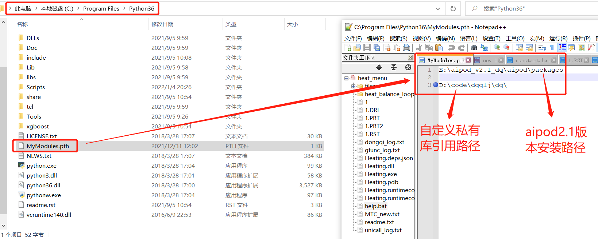
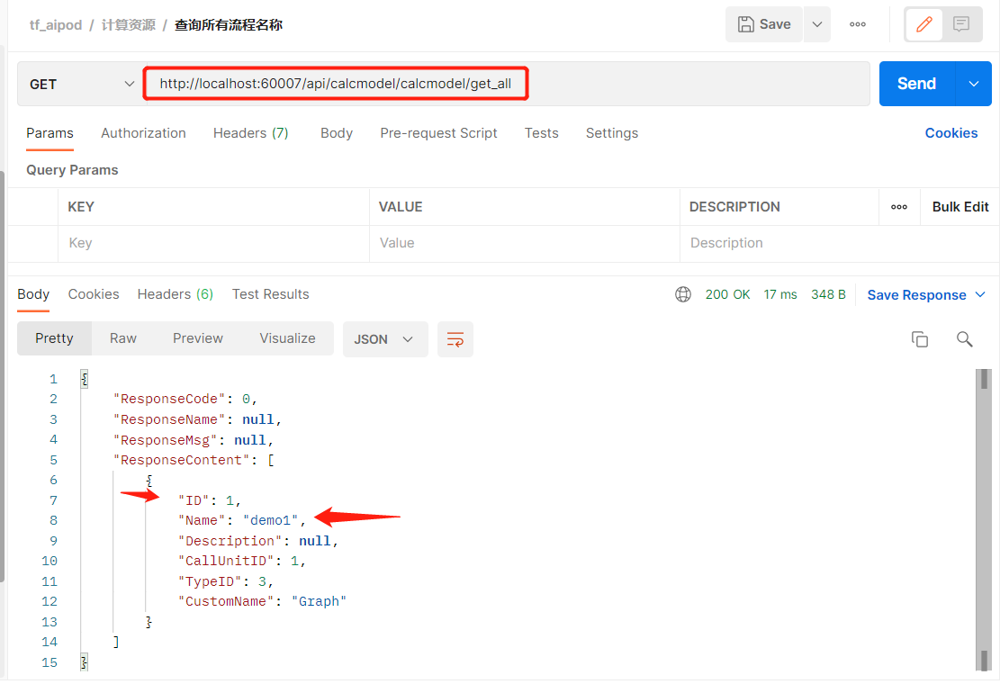
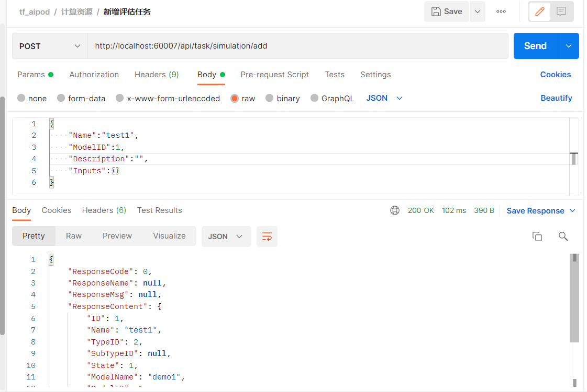
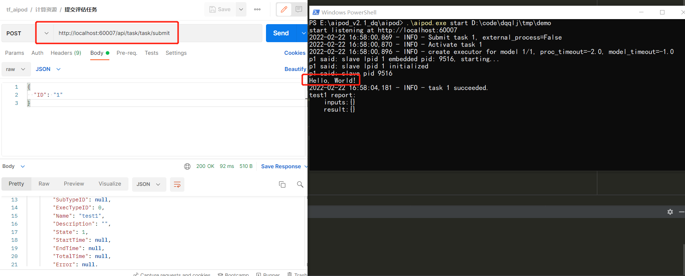

## 基础环境搭建和启动
### UniLab 安装
* 下载并安装最新的UniLab平台并配置license(联系郭震)
* 通过链接下载并安装[Python3.6](https://www.python.org/downloads/release/python-365/)

### pth 文件配置
    Python在遍历已知的库文件目录过程中，如果见到一个.pth 文件，就会将文件中所记录的路径
    加入到 sys.path 设置中，于是 .pth 文件说指明的库也就可以被 Python 运行环境找到了

* 如下图配置.pth文件在python.exe所在路径下
* 自定义的私有库用于复杂的函数节点,此处通过在pth文件中导入文件地址，即可当作python的第三方包一样引入

  
### 服务启动
    
    PS D:\hengh\aipod_v2.1> UniLab.exe start cnnc_proj
    start listening at http://localhost:5001

* `UniLab start [proj_name]` - 在UniLab安装目录下打开cwd并键入该命令然后加载项目.

### UniLab概述
* **定义**: 一个开发式的流程建模平台, 
* **描述**: UniLab由流程建模、执行引擎、任务调度三大部分组成，以节点拖拽的形式，建立任意的仿真优化流程, 设定迭代逻辑执行
* **呈现**: UniLab各节点可以通过脚本形式控制是外部商业软件及模型文件等，实现任意复杂流程的自动化
* **特色**: UniLab内置工具箱,提供流程控制功能, 并支持Matlab、Excel、python、exe、dll等封装模块包和软件的集成调用
* **关系**: UniLab作为天洑通用的流程建模支撑平台，提供流程任务底层构建、分发和管理的能力

### 示例: 单函数节点流程(打印hello, world!)
#### 1 编写流程的源码脚本
    import os
    from unicall import DataType
    from aipod import create_default_solution, Solution
    

    def build_project():
        """函数作用: 创建工程文件并构造流程结构及节点的行为"""
        path = os.path.abspath(os.path.join(os.path.dirname(__file__), "../tmp/demo"))
        # sln_db_cli是aipod的接口管理对象 包含了任务管理的上下文信息
        sln_db_cli = create_default_solution(path,
                                             title="",
                                             port=60007,
                                             description="").default.get_db_cli()  # 默认工程

        proc = sln_db_cli.add_process_group(name="demo1", template_name="default")
        model = proc.add_subprocess(type_id=3, name="demo1").model
    
        # 函数节点 打印hello world!
        node = model.add_func_node(name="func1", function="""
    print("hello world!")
    """)
    
        # 线的连接
        model.add_in_line("func1")
        model.add_out_line("func1")
    
    if __name__ == '__main__':
        build_project()  # 主函数执行入口

* **流程说明**: 一个仅打印hello world的流程, 不包含输入输出变量
* **使用说明**: 使用python 解释器或IDE下执行上述脚本, 会在执行目录下生成demo文件夹，该文件夹即为工程文件夹
* **其他说明**: 该流程的工程文件夹使用UniLab启动后，会启动执行监控，状态查询，信息持久化等一系列接口功能给外部调用
#### 2 cmd下使用UniLab启动demo流程服务
    PS E:\aipod_v2.1_dq\aipod> .\aipod.exe start D:\code\dqqlj\tmp\demo
    start listening at http://localhost:60007
#### 3 通过接口查询该工程的流程参数

#### 4 新建评估任务/提交评估任务

